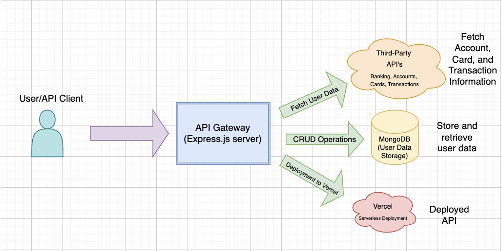

# Gabriel Money: Backend Intern Challenge

## This project is a backend API for managing user data and integrating with third-party banking services using
- Crud Operations for user management
- Aggregated User Information API that fetches and structures data from multiple services
- MongoDB Integration for persistence
- Node.js and Express.js Backend
- Serverless Deployment with Vercel

## API Architecture Diagram
The following diagram represents the API architecture, displaying the interactions between the database, external API's, and API layers.

## Key Components
- Frontend Client: Interacts with the API (e.g., Postman, web app).
- Express.js Server: Handles API requests, processes business logic.
- MongoDB Database: Stores user information.
- Third-Party APIs: External banking services for aggregated user data.
- Vercel Serverless Deployment: Provides a cloud-based hosting solution.

## Setup & Installation

### Prerequisites (Downloads)
- Node.js (>=16)
- MongoDB (Ensure it’s running on `localhost:27017` or set `MONGO_URI` in `.env`)
- Git
- Vercel CLI (for deployment): use npm install -g vercel

### Clone the repository
git clone https://github.com/dmunagapati/gabriel-money-api.git
cd gabriel-money-api

### Install Dependencies
npm install

### Set up the environment variables
create an .env file in the root directory and add the following:
MONGO_URI=mongodb://localhost:27017/gabriel-money
PORT=3000
 NOTE: if you are using MongoDB Atlas (Cloud) replace MONGO_URI with your database connection string

### Start MongoDB
if you are running MongoDB locally, start the service with:

> mongod --dbpath /data/db

else if you are using Homebrew on macOS use:

> brew services start mongodb-community

### Run the server locally

<vercel dev> to start the API server in development mode

### Test the API endpoints

to create a new users (POST):

curl -X POST http://localhost:3000/api/users \
-H "Content-Type: application/json" \
-d '{
    "first_name": "John",
    "last_name": "Doe",
    "email": "john.doe@example.com",
    "phone_number": "+19709456544"
}'

the expected response should be:

{
  "userId": "USERIDHERE"
}

to get user data (GET):

curl -X GET http://localhost:3000/api/users/<USERIDHERE>

this is the expected response

{
    "userId": "USERIDHERE",
    "first_name": "John",
    "last_name": "Doe",
    "email": "john.doe@example.com",
    "phone_number": "+19709456544"
}

to update a user's data (PATCH)

curl -X PATCH http://localhost:3000/api/users/USERIDHERE \
-H "Content-Type: application/json" \
-d '{
    "email": "john.new.email@example.com"
}'

this is the expected response:

{
    "userId": "USERIDHERE",
    "first_name": "John",
    "last_name": "Doe",
    "email": "john.new.email@example.com",
    "phone_number": "+19709456544"
}

to delete a user

curl -X DELETE http://localhost:3000/api/users/USERIDHERE

the expected response:

{
    "message": "User deleted successfully"
}

to fetch aggregated user data (GET):

curl -X GET http://localhost:3000/api/users/375b799c-d2d4-4290-ba8a-3f32d4f5ca92/aggregated-info

this is an example expected response:

{
    "userInfo": {
        "id": "375b799c-d2d4-4290-ba8a-3f32d4f5ca92",
        "name": "User TestAPIGateway",
        "email": "test@gabriel.money",
        "phone": "1111111111"
    },
    "accountInfo": {
        "accountId": "c2759c8e-7d4b-4d63-ab37-c9f8a479c62e",
        "balance": 193561.9,
        "currency": "USD"
    },
    "cardInfo": {
        "cardId": "64072d4f-f127-4ec4-a3e9-87c6ef6f90b3",
        "cardType": "Credit",
        "expiryDate": "08/2033"
    },
    "transactionsInfo": [...]
}

to deploy the API:

vercel --prod

the expected output is a public url where your api is hosted

### Serverless Architecture
 - i deployed the API using a serverless framework called Vercel
 - this removes the need to manage infrastructure, allowing the API to scale automatically

   1. I created a serverless.yml file to define API gateway endpoints and configured AWS Lambda function for serverless deployment
   2. deployed this to vercel

### Clean Code
- I designed modularized code for each concern I was addressing (routes to handle API endpoints, controllers to process requests, models to define the MongoDB schema)
- I followed camelCase for JS variables
- I implemented meaningful function names
- I ensured proper error handling through try-catch blocks and returned meaningful error messages
- I also created comments to make it simpler to read through code and understand the purpose of the lines

### Architecture Diagram
- This was a visual representation of how the API works
- The design included
  1. User/API Client to make API requests
  2. API Gateway to process requests
  3. MongoDB Database to store user data
  4. Third-party APIs to fetch account, card, and transaction data
  5. Vercel to host the API with serverless deployment
- I did this using the tool Draw.io and used clear labels with arrows showing data flow and icons to represent the components

### MongoDB Integration
- I used MongoDB as the database to store user details
- I implemented CRUD operations with Mongoose
  1. I set up the MongoDB connection in the .env file with the line
     > MONGO_URI=mongodb://localhost:27017/gabriel-money
  2. Connected this to MongoDB in database.js
     > const mongoose = require("mongoose");
       mongoose.connect(process.env.MONGO_URI, { useNewUrlParser: true, useUnifiedTopology: true })
       .then(() => console.log("✅ MongoDB Connected"))
       .catch(err => console.error("❌ MongoDB Connection Failed:", err));
  3. Then defined the user schema in models.js
     > const userSchema = new mongoose.Schema({
          first_name: String,
          last_name: String,
          email: { type: String, unique: true },
          phone_number: String
       });
       const User = mongoose.model("User", userSchema);

 

Thank you!
Deepthi Munagapati

